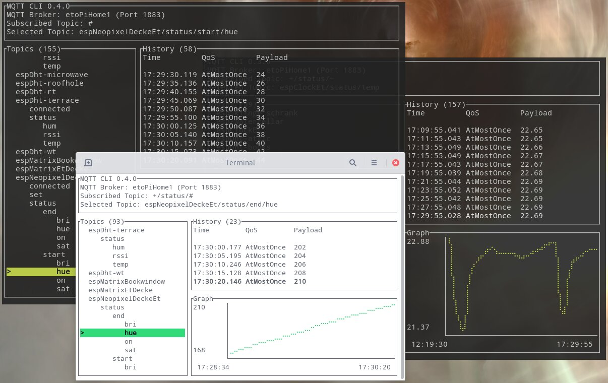

# MQTT CLI


> Subscribe to a MQTT Topic or publish something quickly from the terminal



Taking a look into existing "lets just view MQTT right now" or "quickly publish something" projects they are always quite bulky and not that fast.

Currently I stick with [thomasnordquist/MQTT-Explorer](https://github.com/thomasnordquist/MQTT-Explorer) as it has a great overview of whats going on, a small topic based history and a sorted main view.
But having it running its eating up a lot of resources.

Quickly publish something from command line is also not that fun.
The feature rich cli alternative [hivemq/mqtt-cli](https://github.com/hivemq/mqtt-cli) takes some time to do its job and is not as easy to use as it has a lot of flags to specify.
Subscribing to many topics also isnt as useful to watch at as I hoped for.

Thats why I started building my own terminal based version to quickly watch or publish MQTT stuff.
It wont be as feature rich as something like the hivemq approach but it aims at being easy to use and fast.

## Install

### Prebuilt

Check the [Releases](https://github.com/EdJoPaTo/mqtt-cli/releases).

### From Source

- Clone this repository
- `cargo install --path .`

## Usage

```sh
# Subscribe to everything (#)
mqtt

# Subscribe to topic
mqtt "topic"

# Publish to topic
mqtt "topic" "payload"

# Subscribe to topic with a specific host (default is localhost)
mqtt -h "test.mosquitto.org" "hello/world"
```

```plaintext
MQTT CLI 0.2.0
EdJoPaTo <mqtt-cli-rust@edjopato.de>
Subscribe to a MQTT Topic or publish something quickly from the terminal

USAGE:
    mqtt [FLAGS] [OPTIONS] [ARGS]

FLAGS:
        --help       Prints help information
    -V, --version    Prints version information
    -v, --verbose    Show full MQTT communication

OPTIONS:
    -h, --host <HOST>    Host on which the MQTT Broker is running [default: localhost]
    -p, --port <INT>     Port on which the MQTT Broker is running [default: 1883]

ARGS:
    <TOPIC>      Topic to watch or publish to [default: #]
    <PAYLOAD>    (optional) Payload to be published. If none is given it is instead subscribed to the topic.
```

Tip: Create an alias for the host you are working on:
```bash
alias mqtt-home='mqtt -h pi-home.local'

# Use the alias without having to specify the host every time
mqtt-home "topic" "payload"
```

# Interesting Alternatives

- [thomasnordquist/MQTT-Explorer](https://github.com/thomasnordquist/MQTT-Explorer)
- [hivemq/mqtt-cli](https://github.com/hivemq/mqtt-cli)
